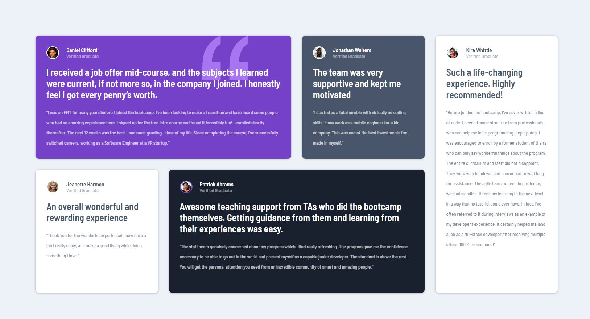
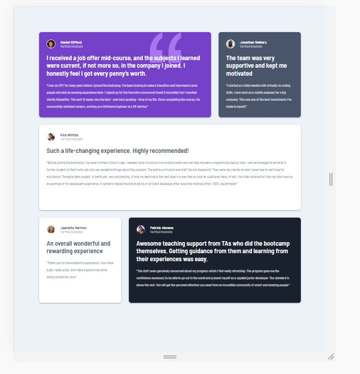
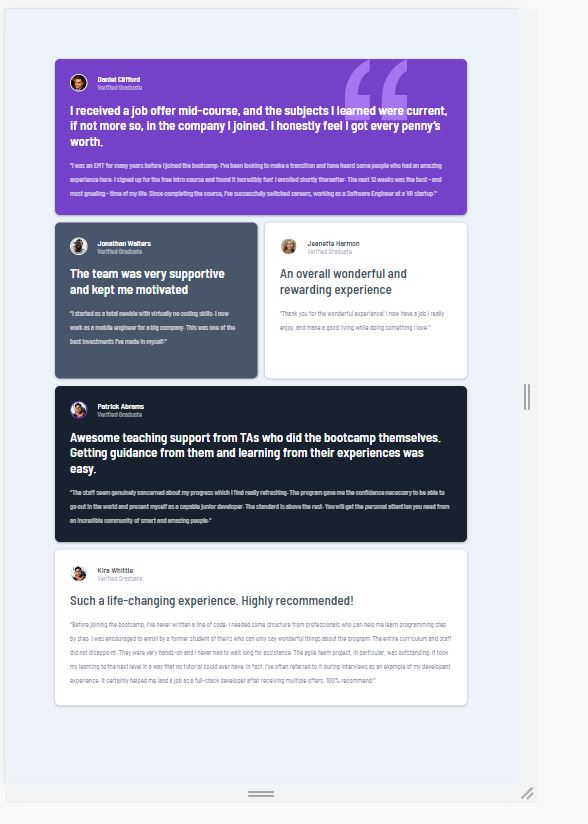
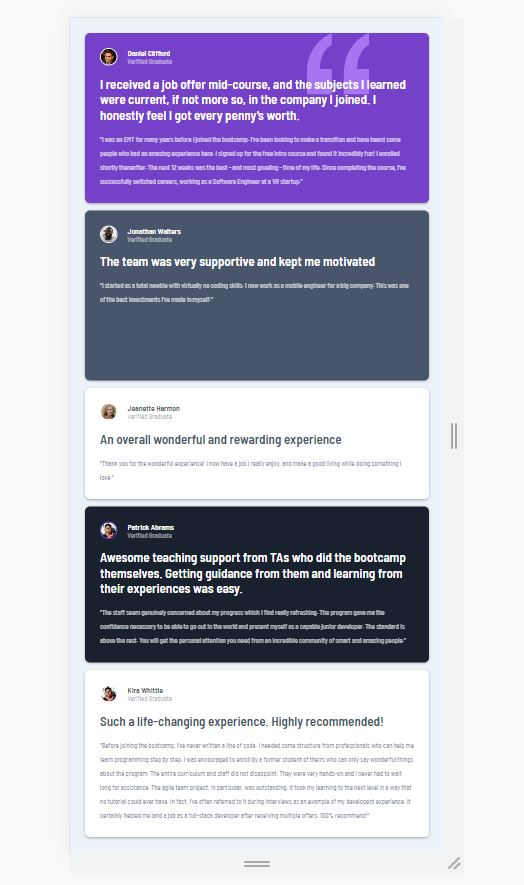

# Frontend Mentor - Testimonials grid section solution

This is a solution to the [Testimonials grid section challenge on Frontend Mentor](https://www.frontendmentor.io/challenges/testimonials-grid-section-Nnw6J7Un7). Frontend Mentor challenges help you improve your coding skills by building realistic projects.

## Table of contents

- [Overview](#overview)

  - [The challenge](#the-challenge)
  - [Screenshot](#screenshot)
  - [Links](#links)

  - [Built with](#built-with)
  - [What I learned](#what-i-learned)

* [Author](#author)

## Overview

### The challenge

Users should be able to:

- View the optimal layout for the site depending on their device's screen size

### Screenshot

### Links

- Solution URL: [GitHub](https://github.com/Roneeey/TestimonialsGrid)
- Live Site URL: [GitHub Pages](https://roneeey.github.io/TestimonialsGrid/)

### Built with

- Media queries
- Flexbox
- CSS Grid

### What I learned

How to apply my knowledge of CSS grid and gain experience in mobile responsiveness.

## Author

- Frontend Mentor - [@Roneeey](https://www.frontendmentor.io/profile/Roneeey)
